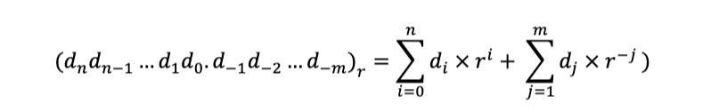
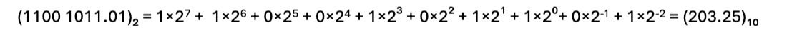
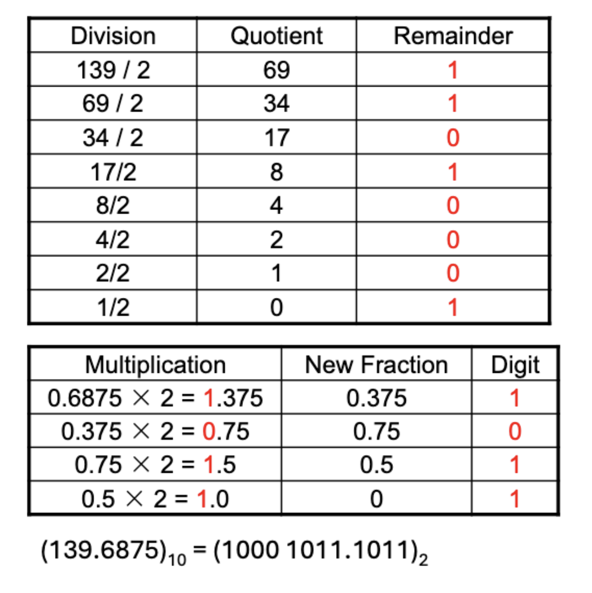
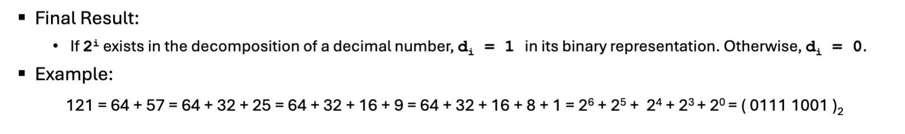
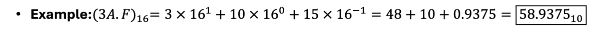
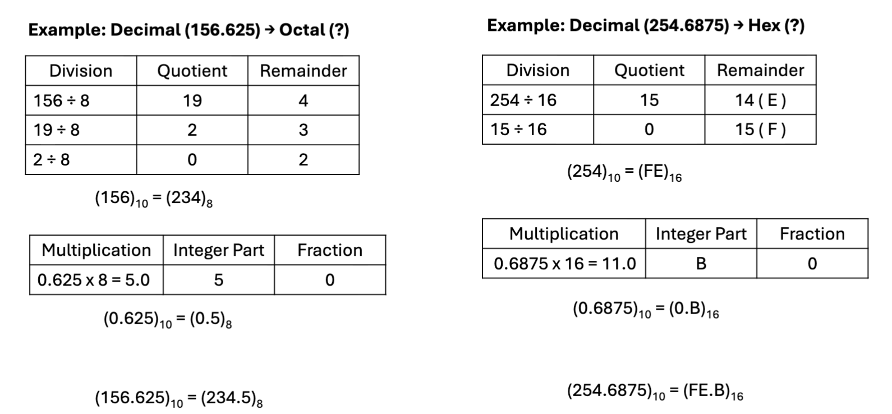
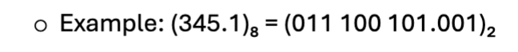
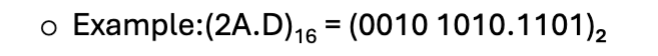
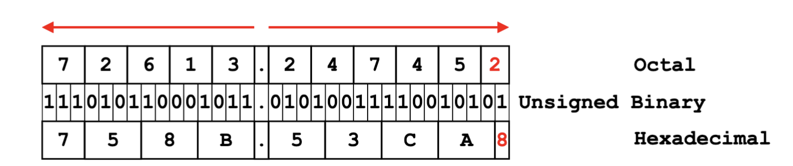

# Class Notes September 01

Summary:

- Unsigned integers
- Binary, Octal and Hexadecimal
- Signed integers
  - Sign magnitude
  - 1's complement
  - 2's complement
- Zero extension vs. Sign extension
- Bit shifting
- Binary/hexadecimal addition and subtraction
- Overflow detection

## 1. Unsigned Number Conversion

### Base r -> decimal

Example:

### Decimal -> base r

#### Integer part: repeated division

- Divide the decimal integer by r
- Record the remainder (first division: d0)
- Replace the decimal integer with the integer quotient
- Repeat the process until quotient becomes 0
- Read remainders in reverse order (last to first) to get the equivalent number in base r

#### Fraction part: repeated multiplication

- Multiply the decimal fraction by the target base r
- Record the integer part of the product (first multiplication: d-1)
- Replace the decimal fraction with the fractional part of the result
- Repeat until the fractional part becomes 0 or the desired precision is reached
- Read the recorded integer parts from top to bottom to get the equivalent fraction in base r

Example:

## 2. Converting Decimal to Binary

## 3. Octal and Hexadecimal

- Octal: base 8 (0 to 7)
  - Each octal digit == 3 binary digits
- Hexadecimal: base 16 (0 to F)
  - Each hex digit == 4 binary digits

Octal -> Decimal:

Hexadecimal -> Decimal:

Decimal -> Octal/Hexadecimal:

Octal/Hex -> Binary:

Binary -> Octal/Hex:

Octal <-> Hexadecimal == Octal <-> Binary <-> Hex

## 4. Signed Integer Representations in Binary

